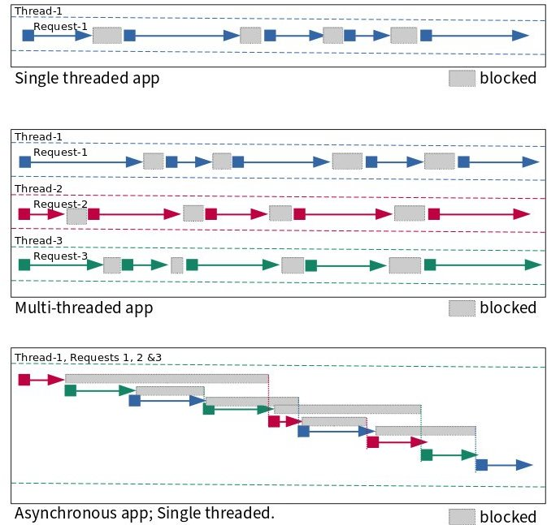
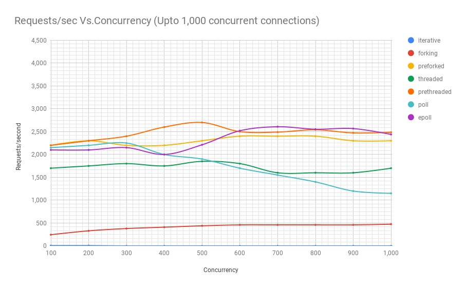
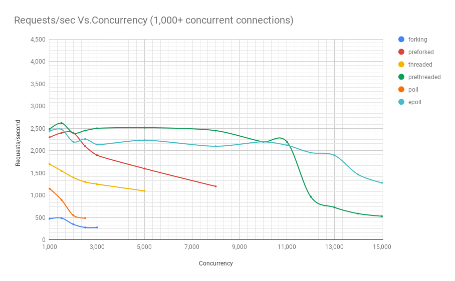
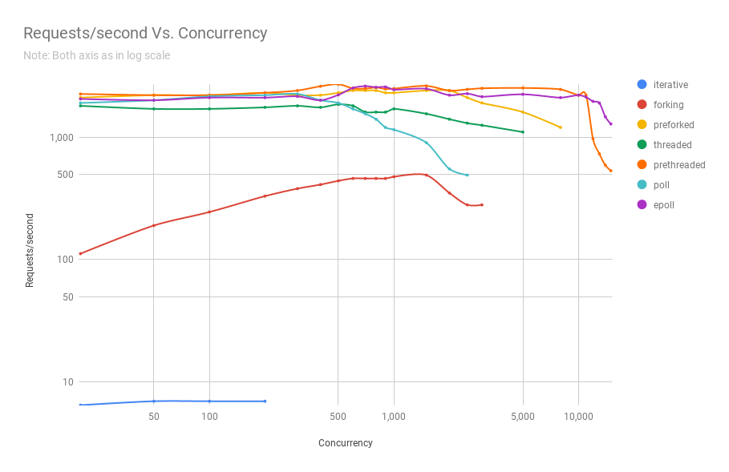

.. _async_intro:

Asynchronous Programming Under Linux
====================================
We live in an age where most applications we use live on the cloud. Every time a user connects to a cloud-based application, most business logic, which is usually written on top of some kind of a web framework runs. Every request is handled either in a separate process, a separate thread, or in asynchronous programs, several requests are handled in the same process. Today, application frameworks based on thread pools and asynchronous models are equally popular. These applications mix calls to networking and file-related system calls in getting their job done.

Processes
^^^^^^^^^
In general, when you call a system call like :man:`read(2)`, your program blocks until the file is read and the data is made available. This generally tends to be pretty fast and you usually do not realize that your program is blocking. But you probably also don't realize that your program, especially on a busy machine was probably switched out of the CPU to run other programs hundreds of times a second. When a system call blocks, your program is unblocked whenever the system call, running in kernel mode returns, continuing to run. If it is like most other programs, it will continue this cycle of blocking and unblocking every time it needs something from the operating system. This paradigm is simple to understand because events happens one after the other in a logical sequence--even though your program may be getting preempted to run other programs or it may be blocked by system calls. If you ignore the fact that your program is preempted to run other programs, it is as if your program executes its logic in sequence.

Multi-threaded programs
^^^^^^^^^^^^^^^^^^^^^^^
In multi-threaded programs, this mental model extrapolates very well. There are many threads of execution in your program. These instances may be instances of the same logic (one instance of a thread created to deal with a client request) or otherwise (a dedicated thread always running in the background to clean up temporary files). These individual threads are preempted or blocked and unblocked by system calls. There are a few of them or several of them running, but this mental model is fairly scalable as well. There still are hairy things like locks and mutexes you'll encounter in your multi-threaded journey, however. But for our discussion, we shall most conveniently ignore them.

Why asynchronous programming?
^^^^^^^^^^^^^^^^^^^^^^^^^^^^^
If you are going to be building something that deals with thousands or even hundreds of thousands of requests per hour, you need not bother with asynchronous I/O. Application frameworks that are designed around thread pool based architectures will serve you just fine. But if you are looking at efficiently dealing with millions of requests per hour and you care about efficiency, you might want to look at asynchronous programming more closely. Asynchronous programming avoids the operating system’s thread/process context switching overhead by processing much of the I/O in a single thread. The operating system's context switching overhead may not seem like much, but it starts to matter when you are dealing with significant scale and concurrency.

Consider the following figure as depicting what happens in with a set of requests in one second. Threads move from blocked to running states. While it is clear what happens in the single threaded and multi-threaded apps, how asynchronous programming works can be a little tricky to understand, although it is no rocket science. I'm hoping the figure below will aid in your understanding.

Below are charts from running experiments with an educational web server which is functionally the same but written using different Linux process models. Here are explanations for the names of the each of the architectures:

* **Iterative**: This server type serves one request after another. While it is serving one request, other requests that might arrive have to wait till the previous one is done processing. There is `a limit <http://man7.org/linux/man-pages/man2/listen.2.html>`_ to how many requests the operating system will queue up. By default, Linux queues up to 128 for kernel versions below 5.4 and 4,096 in newer ones.
* **Forking**: This type of server creates a new process for each request that needs to be served. This way, requests don't have to wait for previous requests to get processed. Different processes server different requests. Also, when there are many processes or threads working, they tend to take advantage of multiple available CPU cores.
* **Preforked**: This type of server avoids the overhead of having to create a totally new process every time a request needs to be served. It does this by creating a pool of processes that are assigned requests as they come in. Only when all the processes in the pool are busy should incoming requests have to wait for their turn to get processed. And administrators will usually have the ability to tweak the number of processes in the pool depending on the load they usually experience.
* **Threaded**: This type of server spawns a new thread every time a request needs to be processed. Threads share a lot of data with the main process creating it and thus incur a slightly lower overhead during creation compared to creating a new process [#]_.
* **Prethreaded**: This is the threads equivalent of the preforked architecture. In this style, a pool of threads are created and threads from the pool are assigned requests as they come in. As in the preforked model, requests have to wait only if all threads are busy processing previously received requests. This is a very efficient model and is the one followed by most web application frameworks.
* **Poll**: This type of server is single threaded and uses the :man:`poll(2)` system call to multiplex between requests. :man:`poll(2)` however is a system call with a serious limitation: it has performance problems scaling to a large number of file descriptors. You can see this from the charts below. In this kind of a design, the state for each request is tracked and a series of callbacks to functions are made that take processing of that request to the next stage.
* **epoll** This is also a type of single-threaded, server that uses the :man:`epoll(7)` family of system calls in place of :man:`poll(2)`, but is otherwise, architecturally the same.

Now that we know what the names of the different architectures mean, let's take a look at how many requests per second they are able to process given a certain concurrency. The three charts below are from the same benchmark, but they zoom into the results to reveal them better.

As you can see, prethreaded, or the thread pool based web server gives the :man:`epoll(7)` based server a run for its money up until a concurrency of 11,000 users in this particular benchmark. And that is a *lot* of concurrent users. Only *very* popular web services experience that kind of concurrency. This is very significant, given that in terms of complexity, thread pool based programs are *way* easier to code compared to their asynchronous counterparts. This also means they are way easier to maintain as well, since they are natually a lot easier to understand.

Read my `article series <https://unixism.net/2019/04/linux-applications-performance-introduction/>`_ that takes a deep look at various Linux process models your application can use. This is done by building functionally same web servers based on various process architectures from scratch.

Making asynchronous programming easier
^^^^^^^^^^^^^^^^^^^^^^^^^^^^^^^^^^^^^^
When you build a program with an asynchronous architecture, you usually use a high-level library that makes your life easier as a developer. Another choice is to layer your program in such a way that you deal with the asynchronous Linux interface in the lowest level while the higher layers provide a more easy-to-use interface on top of which you build features. A good example of a library that abstracts these low-level operating system interfaces are `libevent <https://libevent.org/>`_ and `libuv <https://libuv.org>`_, which powers `NodeJS <https://nodejs.org/en/>`_.

Unless you are writing specialized applications like web frameworks or  high-performance network services, you generally don't need to deal with programming in these low-level APIs. But if you are curious and you want to understand how systems programs work, you are in the right place. In this world, curiosity never kills the cat. More often than not, it turns it into a tiger.

Web application frameworks like `Tornado <https://www.tornadoweb.org/>`_ and NodeJS make it easy for you to write web applications taking advantage of the performance that asynchronous I/O affords. If you were writing a web service, or these days a `desktop applications <https://www.electronjs.org/>`_, you might want to use these these frameworks since they allow you to write your business logic in a high-level language while retaining a lot of performance benefits.

Linux asynchronous APIs before io_uring
^^^^^^^^^^^^^^^^^^^^^^^^^^^^^^^^^^^^^^^
We saw that, with synchronous programming, system calls that deal with reads or writes or remote connections in the case of :man:`accept(2)` would block until data is read, written or a client connection is available, respectively. Until then the said process or thread is blocked. What if you need to do something else? With threads, you can create other threads to take care of these other tasks. For example, the main thread could be blocked on :man:`accept(2)` so that new client connections are immediately attended to, while other threads could be processing requests from previous clients. But what if you needed to remain active to accept client connections while also trying to read from client sockets and while also trying to read or write local file, all in one thread? An FTP server serving(reads) and accepting(writes) files is dealing with both sockets and regular file descriptors, would be a great example. How do you do this in one thread or process? This is where :man:`select(2)`, :man:`poll(2)` and the :man:`epoll(7)` family of system calls come in.

These system calls allow you to monitor a bunch of file descriptors(sockets are file descriptors, too) and let you know when one or more of them are ready. Take for example an FTP sever is waiting to read the next command from a few connected clients while also listening on :man:`accept(2)` for any new client requests. The program would tell :man:`select(2)`, :man:`poll(2)` or the :man:`epoll(7)` family of system calls to monitor these file descriptors and let the program know when there is any activity on one or more of them. For this, you need to structure your program very differently compared to how you'd have done for one that is based processing each request exclusively on a process or a thread.

Linux's :man:`aio(7)` family of system calls can deal asynchronously with both files and sockets. However, there are some limitations that you need to be aware of:

* Only files opened with ``O_DIRECT`` or those opened in unbuffered mode are supported by :man:`aio(7)`. This is undoubtedly its biggest limitation. Not all applications under the usual circumstances want to open files in unbuffered mode.
* Even in unbuffered mode, :man:`aio(7)` can block if file metadata isn't available. It will wait for that to be available.
* Some storage devices have a fixed number of slots for requests. :man:`aio(7)` submission can block if all these slots are busy.
* 104 bytes in total need to be copied for submission and completion. There are also two different system calls (one each for submission and completion) that need to be made for I/O.

The above limitations introduce a lot of uncertainty and performance overheads in the :man:`aio(7)` subsystem.

The trouble with regular files
^^^^^^^^^^^^^^^^^^^^^^^^^^^^^^
On a server that is not very busy, reading or writing a file might not take a long time. Take our FTP server example from above written using an asynchronous design. When it is really busy with a lot of concurrent users who are downloading and uploading a lot of very large files all at the same time, there is one trouble you need to know about, as a programmer. On a server this busy, :man:`read(2)` and :man:`write(2)` calls can begin to block a lot. But won't the :man:`select(2)`, :man:`poll(2)` or the :man:`epoll(7)` family of system calls help us here? Unfortunately not. These systems calls will *always* tell regular files as being ready for I/O. This is their Achilles' heel. We won't go into why this is, but it is important to understand that while they work really well for sockets, they always return "ready" for regular files.

Unfortunately, this makes file descriptors non-uniform under asynchronous programming. File descriptors backing regular files are discriminated against. For this reason, libraries like ``libuv`` use a separate thread pool for I/O on regular files, exposing an API that hides this discrepancy from the user. Read `this excellent article <https://blog.libtorrent.org/2012/10/asynchronous-disk-io/>`_ that surveys asynchronous I/O APIs on various operating systems.

Does this problem exist in io_uring?
^^^^^^^^^^^^^^^^^^^^^^^^^^^^^^^^^^^^
No. ``io_uring`` presents a uniform interface whether dealing with sockets or with regular files. Also, due to the design of the API, programs can get data that is read or written to files descriptors directly rather than knowing when a file descriptor is ready and then starting an I/O operation on it subsequently, as is done with :man:`poll(2)` or :man:`epoll(7)`. This is not the only advantage that ``io_uring`` has over existing Linux asynchronous I/O APIs. We'll discuss more in upcoming sections.

.. rubric:: Footnotes
.. [#] While creating threads or processes under Linux are both done with the :man:`clone(2)` system call and incur the same overhead, right after creation, if a child process, which shared a read-only copy of the parent's address space writes to its pages, the kernel creates a copy of the parent's address space for the child, which is real overhead. Threads in a process share the address space and thus do not incur this copying overhead.
